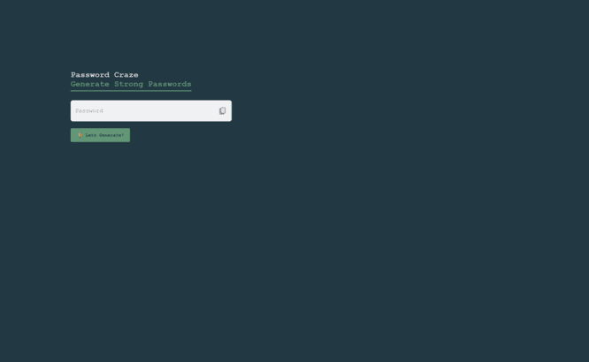
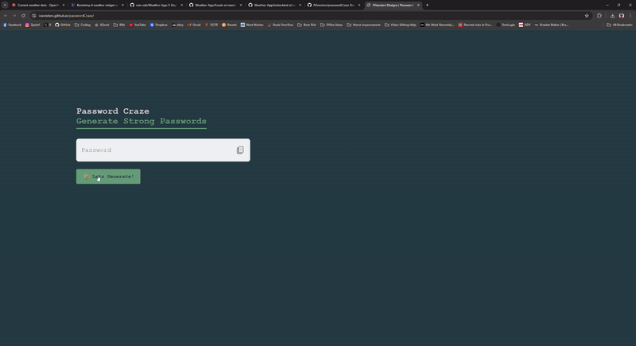

# Password Craze - Password Generator

## Table of Contents

* [About The Project](#about-the-project)
* [Languages](#languages)
* [Features](#features)
* [Usage](#usage)
* [Credits](#credits)
* [License](#license)  

## About The Project

Random password generator project, project will generate a password 14 characters in length using a uppercase, lowercase, numbers and special characters. 

## Languages

* 
* 
* 

## Features

* **Generate button:** allows continuous generation of 14 character passwords  
* **Copy button:** copy button, on click will automatically copy generated password 
* **Alert feature:** application alerts user when password has been copied to clipboard
* **Console feature DEVELOPERS ONLY:** application logs to console on password generation and copy

## Usage

* [Website Link](https://ivionsters.github.io/passwordCraze/)

* [Github Repo](https://github.com/IVIonsters/passwordCraze)

* 
* 

## Credits

* [N/A](N/A)

## License

Random password generator project, project will generate a password 14 characters in length using a uppercase, lowercase, numbers and special characters. 